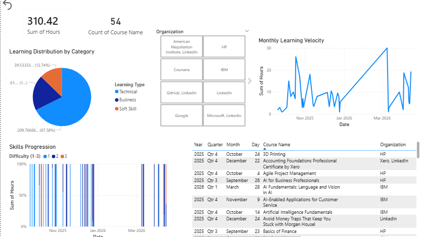
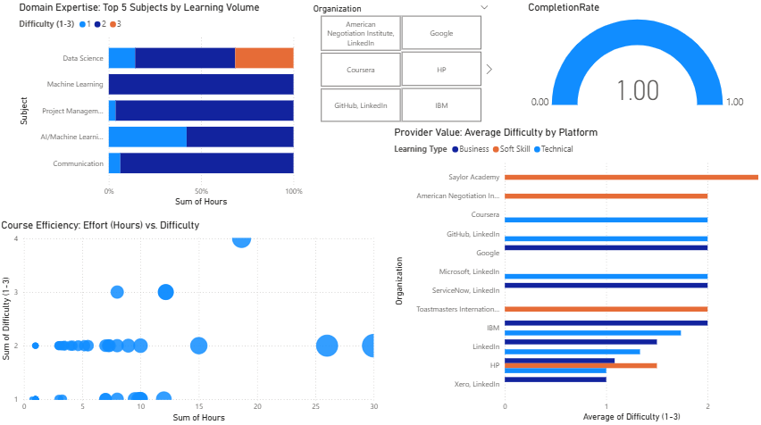

# Personal Learning Intelligence Dashboard
**Tracking 310+ Hours of Technical Upskilling & Career Pivot Velocity**

## 🎯 The Objective
To transform a fragmented history of 55 professional certifications into a centralized Business Intelligence system. This project tracks "Learning Velocity," subject mastery, and ROI on educational platforms (IBM, Google, Microsoft).

## 🛠️ Tech Stack
* **Data Source:** Excel (Self-curated dataset)
* **ETL:** Power Query (Data cleaning, time-conversion, and subject normalization)
* **Analysis:** DAX (Custom measures for Completion Rates and Distinct Counts)
* **Visualization:** Power BI (Multi-page interactive report)

## 📈 Key Insights
* **Learning Velocity:** Reached an all-time high in March 2026, transitioning from Beginner to Intermediate/Advanced content.
* **Domain Expertise:** Dominant focus in **Machine Learning** and **Data Science**, supported by strong foundations in Communication and Project Management.
* **Efficiency:** Identified High-ROI providers by analyzing Average Difficulty vs. Time Invested.
* **Integrity:** Maintained a 100% Completion Rate across verified certifications.

## 📸 Dashboard Preview

